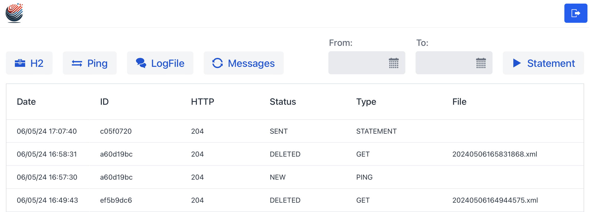

# <span style="color: green;">SGWClient: Integration with Swedbank SGW API</span>

SGWClient is a web application designed to facilitate communication with Swedbank SGW API 2.0.
Developer Portal: [Swedbank Developer Portal](https://developer.swedbank.com)



### <span style="color: #4A90E2;">Dependencies</span>
- **Spring Boot Starters**: Security, Data-Jpa, Test
- **Additional**: Lombok, H2 Database, Apache HttpClient5, Jackson
- **FrontEnd**: Vaadin, CSS
## Getting Started

### Prerequisites for Project Deployment

Before initiating the launch and deployment of the project, ensure that you have gathered the following essential credentials and data:

- **API Key**
- **Certificate File (*.p12) and its password**
- **IBAN Account**
- **Agreement ID**
#### _Additional Documentation see in `docs`_

#### <span style="color: #4A90E2;">Deploy JAR</span>
To package your application in IntelliJ IDEA, follow these steps:
1. Navigate to **Maven** > **Lifecycle** > **package**.
2. Ensure that the **Profile prod** is selected before building.
3. Upon successful build, the JAR file will be located in the `/target` directory, named `SgwClientFree.jar`.

Once the JAR file is built, you can run it using:
```bash
java -Dapp.working.dir=/path_to_app_working_dir -jar /path_to_project/target/SgwClientFree.jar --server.port=8080
```

#### Deploy WAR to Tomcat Docker Container
To deploy application in a Docker container using Tomcat
run [docker-compose.yml](docker-compose.yml) in IntelliJ IDEA.

#### <span style="color: #4A90E2;">Self-Service</span>
- **Logging**: Automatic archiving and overwriting of logs, settings in the `logback-spring.xml` file.
- **Database**: Automatic deletion of old records in the database.

#### <span style="color: #4A90E2;">Configuration (`application.properties` and `logback-spring.xml`)</span>
- **Logs**: Application logging settings.
- **Database**: Database location and access configuration.
- **IBAN**: Unique IBAN for receiving statements.
- **CRON**: Schedule setup to initiate statement requests and message retrieval from the bank.
- **Files**: Paths for saving statements and logs.
- **Keys-Certificates**: Paths and settings for keys to secure connection to the bank's API.
- **URL**: URL path to the bank's API.

### Troubleshooting - Certificate Verification
Quick guide to verify the details of certificates in project.
#### Java Keytool
```bash
keytool -list -v -keystore path_to_file.p12 -storetype PKCS12
```
#### OpenSSL
```bash
openssl pkcs12 -in path_to_file.p12 -nokeys -info
```

## License
[](http://creativecommons.org/licenses/by/4.0/)

This project is licensed under the [Creative Commons Attribution 4.0 International License](http://creativecommons.org/licenses/by/4.0/).

You may use, distribute, and modify it, provided you give attribution.